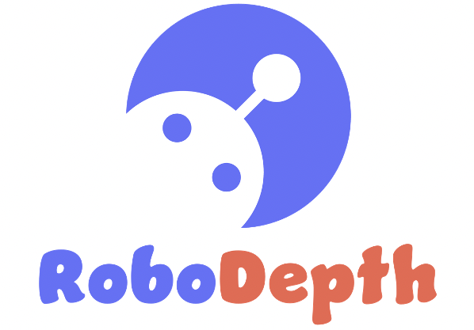
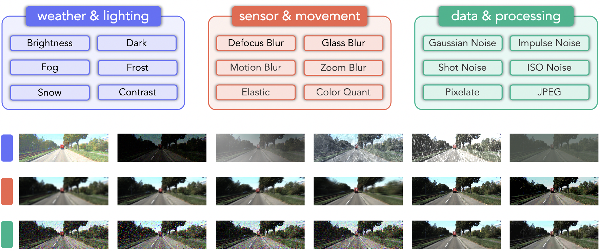

  

## About
Hi there! This is the official account of RoboDepth, a benchmark for probing the out-of-distribution robustness of depth estimation methods.
Depth estimation from monocular and stereo images plays an essential role in real-world visual perception systems. Although promising results have been achieved, the current learning-based depth estimation models are trained and tested on clean datasets while ignoring the out-of-distribution (OoD) situations. Common corruptions, however, tend to happen in practical scenarios, which is safety-critical for applications like autonomous driving and robot navigation. To raise attention among the community to robust depth estimation, we propose the RoboDepth benchmark.

Our RoboDepth is the very first benchmark that targets probing the OoD robustness of depth estimation models under common corruptions. There are 18 corruption types in total, ranging from three perspectives:
1. Weather and lighting conditions, such as sunny, low-light, fog, frost, snow, contrast, etc.
2. Sensor failure and movement, such as potential blurs (defocus, glass, motion, zoom) caused by motion.
3. Data processing issues, such as noises (Gaussian, impulse, ISO) happen due to hardware malfunctions.

## Corruption Taxonomy

  

We break down common corruptions into 18 detailed corruption sources from three aspects: 1) weather and lighting conditions, 2) sensor failure and movement, 3) data processing issues.

## Competition @ ICRA 2023
In this RoboDepth competition, the participants are expected to design novel algorithms that are robust against benchmarked corruptions. Some pos-
sible design perspectives include: robust network architectures, model pretraining strategies, new loss functions, effective data augmentation techniques, etc. With special consideration, the desired model should be able to retain acceptable depth estimation accuracy on our RoboDepth corruption sets, while solely trained with clean data.

For more details, please visit https://robodepth.github.io.

## Contact Us
📫 robodepth@outlook.com

## Acknowledgements
This project is supported by [DesCartes](https://descartes.cnrsatcreate.cnrs.fr/), a [CNRS@CREATE](https://www.cnrsatcreate.cnrs.fr/) program on Intelligent Modeling for Decision-Making in Critical Urban Systems.

We are actively looking for more sponsors. If you are interested, please contact robodepth@outlook.com.

  

<!--
**RoboDepth/RoboDepth** is a ✨ _special_ ✨ repository because its `README.md` (this file) appears on your GitHub profile.

Here are some ideas to get you started:

- 🔭 I’m currently working on ...
- 🌱 I’m currently learning ...
- 👯 I’m looking to collaborate on ...
- 🤔 I’m looking for help with ...
- 💬 Ask me about ...
- 📫 How to reach me: ...
- 😄 Pronouns: ...
- ⚡ Fun fact: ...
-->
